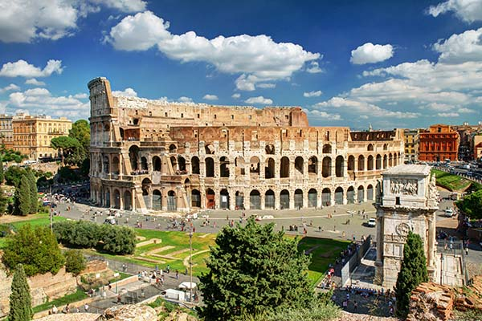
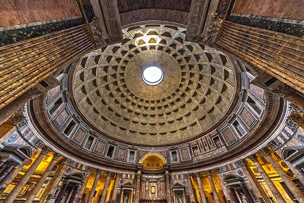
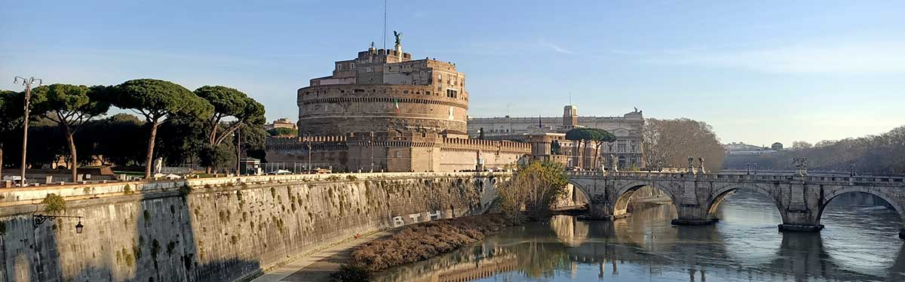

# Oud en Nieuw 2024/2025 - Italië
## Rome en omgeving
### Reis
#### Vliegtuig
**Wizzair**\
Heenweg Maandag 30 December 2024 10:35 (Eindhoven) - 12:50 (Rome Fiumicino) - €59.99 pp\
Terugweg Vrijdag 03 Januari 2025 07:25 (Rome Fiumicino) - 09:50 (Eindhoven) - €89.99 pp\
https://wizzair.com/en-gb/booking/select-flight/EIN/ROM/2024-12-30/2025-01-03 \
**Totaal: €149.98 pp**\
Alternatieve terugweg Vrijdag 03 Januari 20:00 (Rome Fiumicino) - 22:25 (Amsterdam) - €111.06 pp\
https://www.klm.it/en/search/summary/metasearch?tp=111.06&connections=FCO:A:20250103@2000:KL1608:G:GYLOBNLA:ECONOMY%3EAMS:A&pax=1:0:0:0:0:0:0:0&cabinClass=ECONOMY&mp=GO&msp=GoogleFlights&activeConnection=0 \
**Alternatief totaal: 171.05 pp**
#### Autoverhuur
**Europcar**
- Vanaf €66.- per dag
- Totaal vanaf €330.00 - €82.50 pp
- https://www.europcar.com/en-us/reservation/vehicles?vehicleType=CR&pickupLocation=FCOT01&dropoffLocation=FCOT01&pickupYear=2024&pickupMonth=12&pickupDay=30&dropoffYear=2025&dropoffMonth=01&dropoffDay=03&pickupHour=13&pickupMinute=30&dropoffHour=05&dropoffMinute=30&driverAge=26&countryOfResidence=NL

**Autovia**
- Vanaf €32.66 per dag
- Totaal vanaf €163.30 - €40.83 pp
- https://www.autovia.it/en/shop/

**Goldcar**
- Vanaf €52.98 per dag
- Totaal vanaf €264.90 - €66.23 pp
- https://www.goldcar.es/en/reservas/disponibilidad/

**Italy Car Rent**
- Totaal vanaf €101.65 - €25.41 pp
- https://www.italycarrent.com/en/shop/

**Noleggiare**
- Vanaf €27.85 per dag
- Totaal vanaf €139.25 - €34.81 pp
- https://www.noleggiare.it/en/#!#step2auto 
### Verblijf
**Ontspanning en kunst op de vierde verdieping**
- Genzano di Roma
- €375 - €93.75 pp
- 2 slaapkamers
- Gratis parkeren
- Wasmachine
- Oven + gasfornuis
- Wifi
- Douche
- https://www.airbnb.nl/rooms/701124276052441366?check_in=2024-12-30&check_out=2025-01-01&guests=1&adults=1&s=67&unique_share_id=bf81374f-1aa4-48fe-932b-406f93a516cc
  
**Parel van Zee**
- Ostia
- €522 - €130.50 pp
- 3 slaapkamers
- Gratis parkeren
- Wasmachine
- Oven + gasfornuis
- Wifi
- Douche + bad
- https://www.airbnb.nl/rooms/1076049470855767176?check_in=2024-12-30&check_out=2025-01-03&guests=1&adults=1&s=67&unique_share_id=5b0a3290-025f-465f-8c2a-cce40fcb2554

**Casa Cristina**
- Marino
- €503 - €125.75 pp
- 2 slaapkamers
- Gratis parkeren op straat
- Wasmachine
- Oven + gasfornuis
- Wifi
- Douche
- https://www.airbnb.nl/rooms/1082551894023936949?check_in=2024-12-30&check_out=2025-01-03&guests=1&adults=1&s=67&unique_share_id=8f33b93c-7bce-4a7c-8086-fbc65c4961f3

**Villa Aranova is een stijlvol en modern huis**
- Ara Nova
- €384 - €96 pp
- 3 slaapkamers
- Gratis parkeren
- Wasmachine
- Oven + gasfornuis
- Wifi
- Douche + bad
- https://www.airbnb.nl/rooms/981839?check_in=2024-12-30&check_out=2025-01-03&guests=1&adults=1&s=67&unique_share_id=9a3259fc-19f8-40f9-ad45-7a5fc736678c
### Activiteiten
**Colosseum, Forum Romanum & Palentijn**\

- €18.00 pp
- 08:30 - 16:30

**Pantheon**\

- €5.-
- 09:00 - 19:00

**Castel Sant’Angelo**\

- €16,-
- 09:00 - 19:30